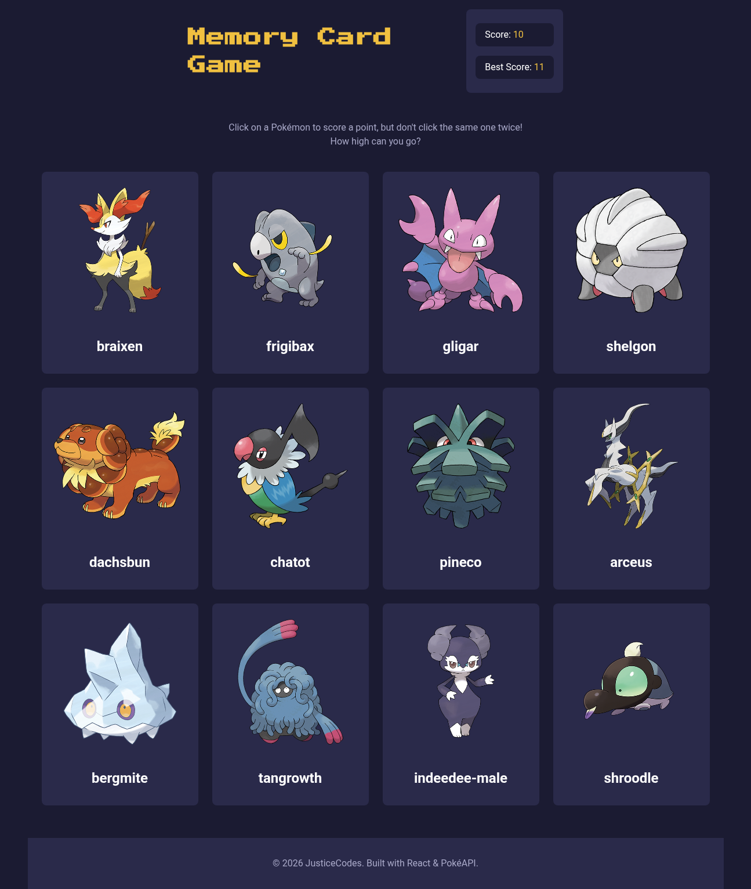

# Pokémon Memory Card

A memory card game built with React. Test your memory by clicking on Pokémon, but don't click the same one twice!

## Live Demo

[Live Demo](./src/assets/screen-shot.png)

## Screenshot



## Features

- 12 random Pokémon fetched from PokéAPI every round
- Score tracking — earn a point for every new Pokémon you click
- Best score tracking — your highest score is saved for the session
- Cards shuffle after every click to keep you on your toes
- Fresh set of Pokémon fetched at the start of every new round
- Fallback cards if the API is unavailable

## Tech Stack

- React
- Vite
- PokéAPI
- CSS

## Running Locally

```bash
git clone https://github.com/justiceCodes/odin-memory-card.git
cd odin-memory-card
npm install
npm run dev
```

## Acknowledgements

- [PokéAPI](https://pokeapi.co/) for the Pokémon data
- [The Odin Project](https://www.theodinproject.com/) curriculum